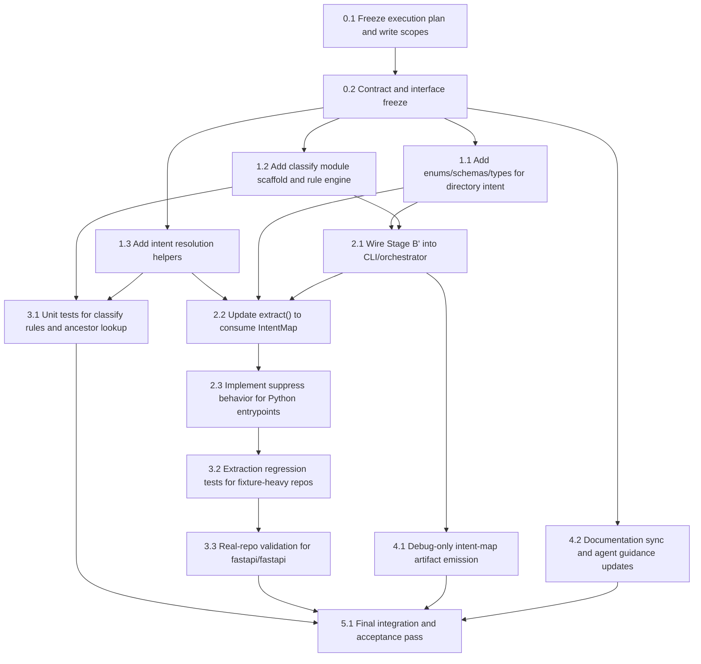

# Phase 3 Kanban

This Kanban translates the frozen Phase 3 whitepaper into an implementation
plan.

Authoritative design source:

- `docs/phase3/foundation.md`
- `docs/phase3/contracts.md`
- `docs/phase3/artifact-spec.md`
- `docs/phase3/repo-structure.md`

This Kanban is an execution document derived from those four files. If this
plan conflicts with the frozen design pack, the frozen design pack wins.

## Single-Model Parallel Rule

Phase 3 parallelism assumes multiple agents of the same model family can work
in parallel after interface freeze.

Rules:

- treat this as same-model parallel execution, not cross-model specialization
- parallel tasks must have disjoint primary write scopes
- no agent should redefine contracts, classifier semantics, or extraction policy
  once the interface-freeze wave is complete without updating the frozen docs
- integration remains a single-owner task

## Delivery Milestones

- `M0`: frozen docs, kanban, and interface freeze
- `M1`: contracts and Stage B' classifier scaffold land
- `M2`: Python extraction consumes `IntentMap` with suppression behavior
- `M3`: tests, regression validation, and CLI/debug artifact path are stable
- `M4`: full Phase 3 documentation and integration polish are complete

## Dependency Graph

## Parallel Waves

### Wave 0: Interface Freeze

Owner: integration lead  
Milestone: `M0`

- [ ] `0.1` Confirm frozen whitepaper is the sole Phase 3 design source
- [ ] `0.2` Freeze:
  - [ ] `DIRECTORY_INTENTS`
  - [ ] `IntentMap` contract
  - [ ] `DirectoryEvidence` shape
  - [ ] `DirectoryClassifier` interface
  - [ ] suppression-first policy for Python fixture surfaces
- [ ] `0.3` Freeze work partition so later parallel tasks do not overlap

Write scope:

- `docs/phase3/`
- `docs/phase3/execution/kanban.md`

## Backlog

### Epic 1: Contracts And Classifier Surface

Owner: Agent A  
Milestone: `M1`  
Depends on: `0.2`

- [ ] `1.1` Add directory intent enums
- [ ] `1.2` Add `directoryIntent` schema
- [ ] `1.3` Add `intentMap` schema
- [ ] `1.4` Add types for:
  - [ ] `DirectoryIntent`
  - [ ] `IntentMap`
  - [ ] `DirectoryEvidence`
  - [ ] `DirectoryClassifier`
- [ ] `1.5` Keep artifact family version semantics aligned with current `2.0`

Primary write scope:

- `src/contracts/`
- contract tests only if needed

Parallel safety:

- may run in parallel with Epic 2 after `0.2`
- must not overlap with extractor implementation files

### Epic 2: Classify Module

Owner: Agent B  
Milestone: `M1`  
Depends on: `0.2`

- [ ] `2.1` Create `src/classify/index.ts`
- [ ] `2.2` Create `src/classify/engine.ts`
- [ ] `2.3` Create `src/classify/rules.ts`
- [ ] `2.4` Implement bounded depth directory collection
- [ ] `2.5` Implement rule priority and conflict resolution
- [ ] `2.6` Implement nearest-ancestor intent lookup helper

Primary write scope:

- `src/classify/`

Parallel safety:

- can run in parallel with Epic 1 and Epic 4 after `0.2`
- should expose stubs/interfaces early so extraction work can start

### Epic 3: Orchestration And Extraction

Owner: Agent C  
Milestone: `M2`  
Depends on: `1.1`, `2.1`

- [ ] `3.1` Wire Stage B' into CLI/orchestration flow
- [ ] `3.2` Update `extractSignals()` to accept `IntentMap`
- [ ] `3.3` Resolve file intent by nearest classified ancestor
- [ ] `3.4` Suppress primary Python entrypoint extraction for:
  - [ ] `example-fixtures`
  - [ ] `test-infrastructure`
- [ ] `3.5` Preserve Phase 2 behavior when intent resolution returns `unknown`

Primary write scope:

- `src/cli/`
- `src/extract/`
- any minimal exports in `src/index.ts`

Parallel safety:

- starts after Epic 1 interface and Epic 2 scaffold are stable
- should not modify `src/classify/rules.ts`

### Epic 4: Classifier Tests

Owner: Agent D  
Milestone: `M2`  
Depends on: `0.2`

- [ ] `4.1` Add `tests/classify/` coverage
- [ ] `4.2` Add rule-priority tests
- [ ] `4.3` Add ancestor fallback tests
- [ ] `4.4` Add boundary tests for:
  - [ ] flat repos
  - [ ] unknown-only classification
  - [ ] empty-directory tolerance

Primary write scope:

- `tests/classify/`

Parallel safety:

- can run in parallel with Epic 2
- may need light fixture additions if isolated

### Epic 5: Extraction Regression And Real-Repo Validation

Owner: Agent E  
Milestone: `M3`  
Depends on: `3.4`

- [ ] `5.1` Add extraction regression tests proving fixture suppression
- [ ] `5.2` Validate `fastapi/fastapi` as primary real-repo target
- [ ] `5.3` Add one structurally different regression target
- [ ] `5.4` Record expected Phase 3 quality gates

Primary write scope:

- `tests/extract/`
- `tests/fixtures/`
- validation notes if needed under `docs/phase3/` or another non-canonical
  execution doc

Parallel safety:

- starts after extractor suppression behavior lands
- should avoid touching core contracts

### Epic 6: Debug Artifact And CLI Output Policy

Owner: Agent F  
Milestone: `M3`  
Depends on: `1.3`, `3.1`

- [ ] `6.1` Emit `intent-map.json` only in debug or equivalent developer mode
- [ ] `6.2` Write it under `work/runs/<run-id>/debug/`
- [ ] `6.3` Keep canonical user-facing artifacts unchanged

Primary write scope:

- `src/cli/`
- output helper code under `src/shared/` if required

Parallel safety:

- may run alongside Epic 5 once orchestration is stable
- coordinate with Epic 3 if both touch `src/cli/`

### Epic 7: Docs And Coordination

Owner: integration lead  
Milestone: `M4`  
Depends on: `5.4`, `6.3`

- [ ] `7.1` Sync frozen docs if implementation exposes contract gaps
- [ ] `7.2` Keep `docs/phase3/agent-guide.md` aligned with settled Phase 3 rules
- [ ] `7.3` Update Kanban status and dependency notes
- [ ] `7.4` Prepare PR summary and acceptance notes

Primary write scope:

- `docs/phase3/`
- `docs/phase3/execution/kanban.md`

Parallel safety:

- should not redefine code behavior after acceptance freeze without explicit
  coordination

## Recommended Parallel Routes

These are the safe same-model parallel routes after Wave 0:

### Route A: Contracts + Classifier Buildout

- Agent A: Epic 1
- Agent B: Epic 2
- Agent D: Epic 4

Reason:

- write scopes are mostly disjoint
- classifier tests can start once interfaces are frozen

### Route B: Extraction + Debug Output

- Agent C: Epic 3
- Agent F: Epic 6

Start condition:

- after Epic 1 and Epic 2 expose stable types and classify entrypoints

Risk:

- both may need `src/cli/`

Mitigation:

- pre-assign `src/cli/` ownership to one route at a time, or split by file
  ownership before both begin

### Route C: Validation

- Agent E: Epic 5

Start condition:

- after suppression behavior is present in extraction

Reason:

- validation is downstream and should not block earlier interface work

## Critical Path

The critical path is:

`0.2 -> 1.1/2.1 -> 3.1 -> 3.4 -> 5.2 -> 7.4`

Interpretation:

- no amount of parallel work matters if contracts and classify interfaces are
  not frozen first
- FastAPI validation is the acceptance gate for the Phase 3 value claim

## Acceptance Gates

Phase 3 is not done until all of the following are true:

- [ ] `IntentMap` contracts are implemented and validated
- [ ] classifier logic is bounded to depth `2`
- [ ] extraction suppresses primary Python fixture entrypoints
- [ ] `fastapi/fastapi` no longer floods primary entrypoint and read-first views
- [ ] one structurally different regression target still produces credible
      navigation
- [ ] `intent-map.json` is debug-only
- [ ] frozen docs and implementation still agree
